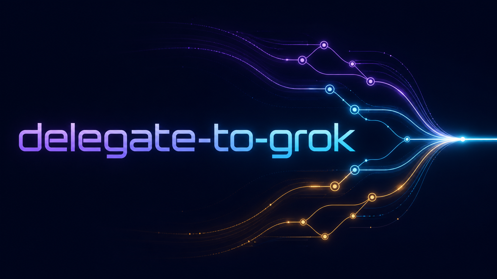

<p align="center">
  
</p>

<p align="center">
  <a href="https://github.com/Sunwood-ai-labs/delegate-to-grok-skill/actions/workflows/ci.yml"></a>
  <a href="https://github.com/Sunwood-ai-labs/delegate-to-grok-skill/releases/tag/v0.1.0"></a>
  <a href="LICENSE"></a>
</p>

<p align="center"><a href="README.ja.md">日本語</a> · <a href="https://sunwood-ai-labs.github.io/delegate-to-grok-skill/">Documentation</a> · <a href="SECURITY.md">Security</a> · <a href="CONTRIBUTING.md">Contributing</a></p>

## 🧩 What it enables

- Delegate repository investigation, code review, comparisons, public X research, and implementation-support tasks to Grok Build.
- Keep Codex in charge of the task scope, evidence review, test strategy, and final decision.
- Bring Grok findings back as a second perspective before you integrate a change or report a conclusion.
- Coordinate multiple independently scoped tracks at the Codex workflow level. This wrapper deliberately keeps each Grok CLI invocation single-flight.

## ⚙️ Execution contract

The wrapper supplies a predictable execution contract: prompts use a temporary file, permissions and workspace boundaries are explicit, and authentication/session checks are verified around the task. Read-only is the default; `-AllowWrites` is an explicit user-authorized escalation.

## 🚀 Install

Prerequisites: Windows PowerShell 5.1+ or PowerShell 7+, Codex, and a locally installed `grok` command. Authenticate separately with `grok login --oauth` when `grok models` explicitly reports that authentication is needed.

```powershell
git clone https://github.com/Sunwood-ai-labs/delegate-to-grok-skill.git
Copy-Item -Recurse -Force .\delegate-to-grok-skill\skill "$env:USERPROFILE\.codex\skills\delegate-to-grok"
```

Restart or refresh Codex so it discovers the skill.

## 🧭 Delegate a task

```powershell
& "$env:USERPROFILE\.codex\skills\delegate-to-grok\scripts\invoke-grok.ps1" `
  -WorkingDirectory 'D:\Projects\example' `
  -Prompt 'Review this project architecture without changing files.'
```

The working directory itself is the default allowed root. Specify `-AllowedRoot` only when the task deliberately targets a child of a confirmed parent directory. Add `-AllowWrites` only when the user explicitly requested file changes.

```powershell
& "$env:USERPROFILE\.codex\skills\delegate-to-grok\scripts\invoke-grok.ps1" -Help
```

## 🧭 Coordinate multiple tracks

Use Grok as one focused lane among Codex-managed workstreams: delegate a review or comparison, collect its evidence, and have Codex reconcile the result with other agents or primary sources. Do not present the wrapper as enabling Grok-internal parallelism: it intentionally serializes Grok CLI runs.

## 📚 Documentation

Browse the [English and Japanese documentation site](https://sunwood-ai-labs.github.io/delegate-to-grok-skill/) for setup, delegation rules, troubleshooting, and release notes.

## 🧪 Development

Run the repository checks on Windows:

```powershell
powershell -NoProfile -ExecutionPolicy Bypass -File .\tests\verify.ps1
npm --prefix .\docs run docs:build
```

The checks parse the wrapper, validate the skill metadata, exercise `-Help`, and verify that an out-of-bound directory is rejected before Grok is invoked. They do not require a Grok account or network access.

## 🔐 Security

Report vulnerabilities privately and keep OAuth state, prompts containing credentials, and account diagnostics out of issue reports. See [SECURITY.md](SECURITY.md).

## 🤝 Contributing

Read [CONTRIBUTING.md](CONTRIBUTING.md) before proposing changes. The wrapper must remain the only supported headless invocation path.

## 📄 License

MIT. See [LICENSE](LICENSE).

<p align="center">
  
</p>
